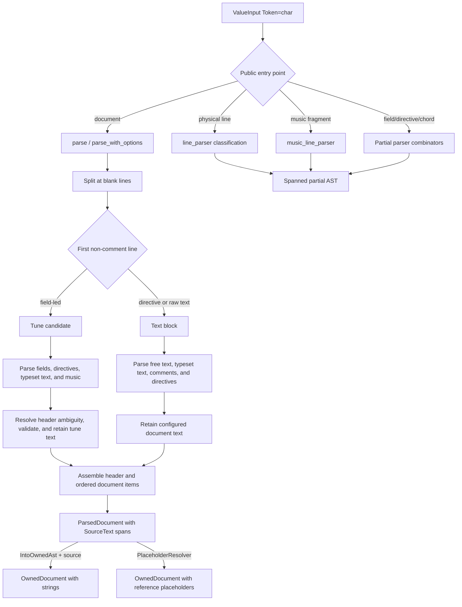
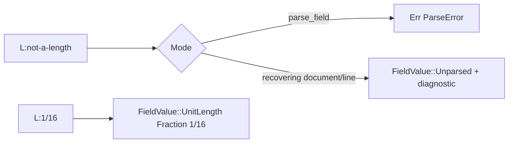
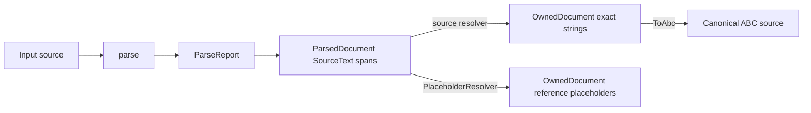
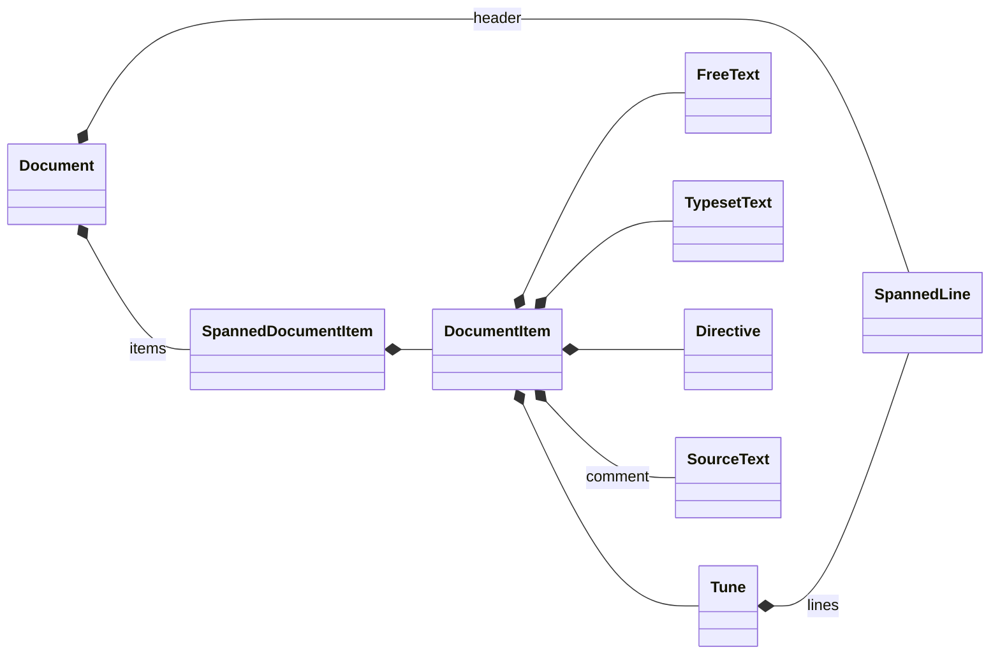
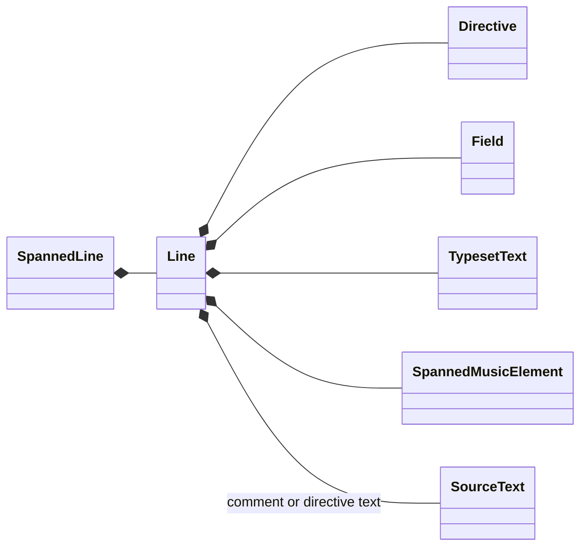
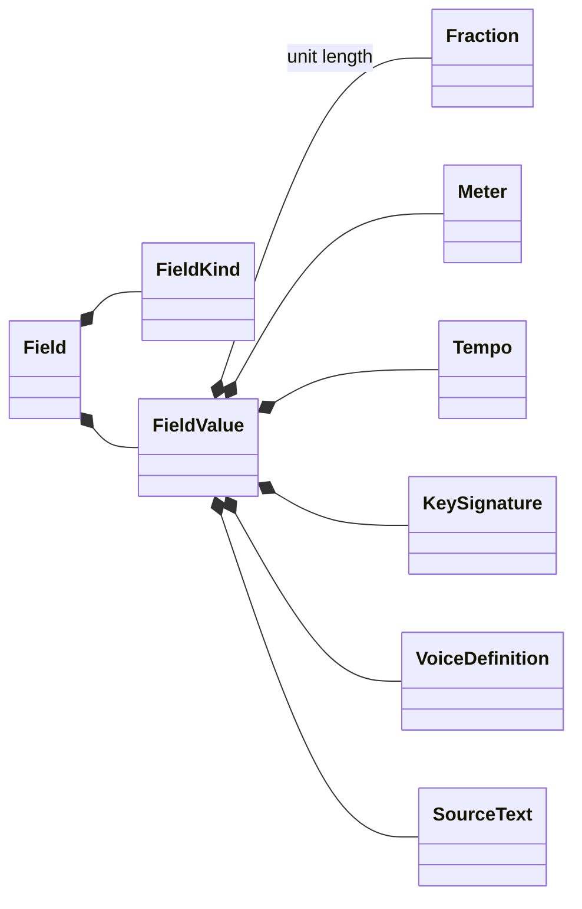
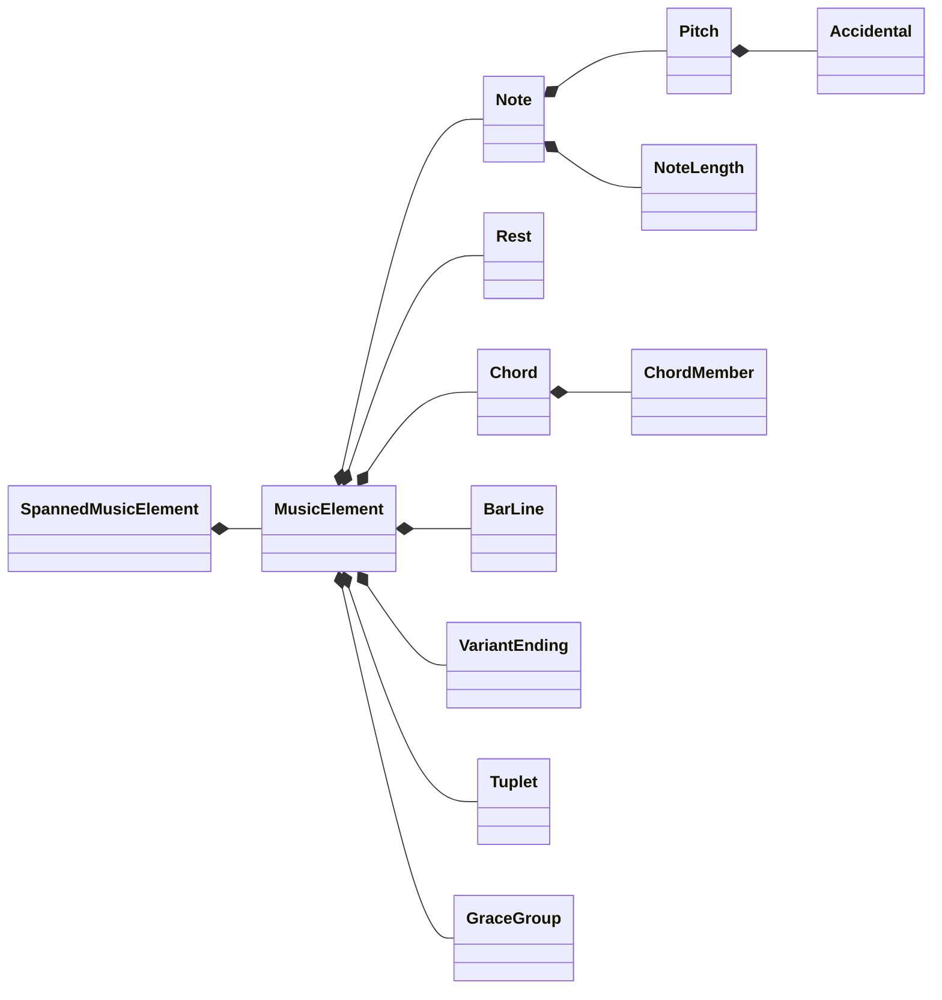

# Parser architecture

This section describes how character input reaches the public AST. Parser
constructors are generic over Chumsky's `ValueInput<Token = char>` (a by-value
character-input specialization of `Input`). Every [`Spanned`] node uses the
input's native `Input::Span`: `&str` therefore reports UTF-8 byte offsets while
`&[char]` reports character indices.

## Entry points

[`parse`] is the default complete-document API. [`parse_with_options`] accepts
an additional [`ParserOptions`] value for configurable text retention and
strict tune validation. Both return a [`ParseReport`] whose optional output is
a source-backed [`ParsedDocument`]. Errors and warnings use the input's native
span type. Recovery normally supplies output alongside diagnostics; an
unrecoverable failure returns no output. Advisory [`ParseReport::warnings`] do
not make the report invalid.

Generic partial-input constructors are [`line_parser`], [`music_line_parser`],
[`music_element_parser`], [`field_parser`], [`directive_parser`], and
[`chord_parser`]. The `&str` convenience functions are
[`parse_line`], [`parse_music_line`], [`parse_field`], [`parse_directive`], and
[`parse_chord`].

The diagrams are stored as Mermaid source in this file and rendered as inline
SVG in the generated documentation. The surrounding text contains the same
information in documentation formats that do not display SVG.

## Complete-document flow

The private complete-document parser composes the source at physical-line
granularity:

1. Empty lines divide the input into blocks and terminate tunes.
2. Leading `%` comments are transparent to classification. An ASCII letter
   followed by `:` selects tune mode; directives and raw lines select text mode.
   In the initial block, known tune-only fields distinguish a recoverable tune
   without `X:` from an ambiguous file header containing shared fields.
3. Chumsky groups tune lines, free-text runs, comments, directives, and typeset
   blocks directly into semantic units. Tune lines use diagnostic music
   recovery, while free text retains raw spans without invoking that grammar.
4. A strict probe of a raw deciding line records a non-fatal
   [`ErrorKind::MissingReference`] warning when the whole line is valid music;
   the parser classifies the block as free text.
5. `map_with` attaches native input spans. Parser state carries typed document
   diagnostics separately from Chumsky's `Rich` token-error channel.
6. The initial metadata-only block is the file header. Subsequent field-led
   blocks are [`Tune`] values even when their first field is not `X:`.
7. Text-retention options are applied while semantic text items and tune lines
   are built. Strict tune validation runs while each tune candidate is resolved.
   The resulting header and document items are then assembled in source order.

Physical lines are intentional recovery boundaries. ABC fields, directives,
comments, and most music layout constructs cannot consume an arbitrary following
line, so the next line is a dependable place to resume after an unclosed chord,
grace group, decoration, or annotation.

## Free text and typeset text

[`Document::items`] preserves the order of tunes, [`FreeText`] blocks,
file-level [`TypesetText`], comments, and stylesheet directives following the
optional initial header. A tune ends at an empty line or EOF. This prevents
letters in inter-tune prose from being interpreted as notes. A fieldless block
stays in text mode: ordinary lines become free text, while recognized comments,
directives, and typeset constructs keep their semantic node types. If a raw
deciding line is valid music, [`parse`] reports an advisory warning.

`%%text` and `%%center` are typed text nodes. A `%%begintext` through
`%%endtext` sequence is one block node; each standard body line must begin with
`%%`. The same nodes may occur in tune headers and bodies through
[`Line::TypesetText`].

[`ParserOptions`] retains both text categories by default. Its
[`ParserOptions::retain_free_text`] and
[`ParserOptions::retain_typeset_text`] builders independently omit the
corresponding AST nodes. Parsing and validation precede omission, so
retention choices never hide diagnostics.

[`ParserOptions::strict`] additionally requires each tune to contain an `X:`
reference field. The field may occur anywhere in the tune; a missing field is a
recoverable error, so the returned document includes the tune.
Strict mode also warns when `X:` is not the first information field or when a
header-level `K:` is present but is not the last information field before music
code. Comments and stylesheet directives do not affect field ordering, and key
changes in the tune body are excluded.

## Information-field flow

[`Field`] records the original letter as [`Field::key`], its standard category
as [`Field::kind`], and a semantic [`FieldValue`]. Structured values use
dedicated parsers:

| Field | AST payload | Examples |
| --- | --- | --- |
| `L:` | [`FieldValue::UnitLength`] | `L:1/8` |
| `M:` | [`FieldValue::Meter`] | `M:3/4`, `M:2+3/8`, `M:C` |
| `Q:` | [`FieldValue::Tempo`] | `Q:1/4=120` |
| `K:` | [`FieldValue::Key`] | `K:G mixolydian clef=bass` |
| `X:` | [`FieldValue::Reference`] | `X:12` |
| `V:` | [`FieldValue::Voice`] | `V:1 name="Soprano"` |
| `P:` | [`FieldValue::Parts`] | `P:A.B.(CD)2` |
| `U:` | [`FieldValue::UserSymbol`] | `U:H=!fermata!` |
| `m:` | [`FieldValue::Macro`] | `m:~n2 = ...` |

Metadata such as titles and composers is represented by
[`FieldValue::Text`]. Application-defined field letters are classified as
[`FieldKind::Extension`] and also retain their text.

Strict [`parse_field`] returns [`ParseError`] when a structured value is
malformed. During document or line recovery, the same payload is retained as
[`FieldValue::Unparsed`] and a diagnostic is added. Inline fields follow the
same rule.

## Music-code flow

[`music_line_parser`] is
`music_element_parser().repeated().at_least(1).collect()`. The element parser is
a `choice` of bracketed constructs, grace groups, quoted annotations,
decorations, grouped operators, notes/rests, and a one-character recovery
fallback. Repetition and delimiter ownership are handled by Chumsky primitives;
`validate` emits non-fatal `Rich` errors, and `map_with` attaches the native
input span.

Bracketed input is disambiguated before general tokens:

1. `[A:value]` is an inline field.
2. `[1`, `[1,3`, and `[2-4` are variant endings.
3. `[|...` is a bar line.
4. Other bracketed input is a [`Chord`].

Notes are recognized by chained `one_of`, `repeated`, `then`, and `map`
combinators, then decomposed into [`Pitch`], optional [`Accidental`], octave,
and [`NoteLength`]. Chords contain typed [`ChordMember`] values rather than
source strings. Chumsky enforces non-empty, delimiter-safe chord interiors while
producing semantic members directly; there is no secondary string scanner.

## Source-backed text and ownership

[`ParsedDocument`] stores source-derived text as [`SourceText::Span`] using the
input's native span type. Parser-generated or normalized values use
[`SourceText::Synthesized`]. Consequently, parsing does not allocate a `String`
for every title, comment, directive argument, decoration, or recovery token.
The span-only AST itself does not borrow the source and may outlive it, although
exactly recovering its text later requires the matching source.

[`IntoOwnedAst::into_owned`] recursively converts a parsed document or subtree
to its `String`-backed equivalent. Passing the original `str` resolves
`SimpleSpan<usize>` as UTF-8 byte offsets; passing the original `[char]` resolves
the same span type as character indices. Invalid source/span combinations
return [`ResolveError`]. This operation copies source-backed text into the
standalone tree and moves synthesized strings without copying.

When the source is unavailable or unwanted, [`PlaceholderResolver`] emits the
documented form `[[ABC_SOURCE_REF:<Debug span>]]`. Use
[`is_source_reference_placeholder`] for heuristic detection. A legitimate ABC
source can contain the same shape, so detection cannot prove provenance.

## ABC source emission

[`ToAbc`] writes owned or otherwise `AsRef<str>`-backed AST nodes as canonical
ABC notation. It is implemented for complete documents and tunes as well as
individual lines, fields, music elements, pitches, durations, and other public
semantic nodes. [`AbcEmitter`] carries a destination, [`EmitOptions`], and any
context needed while recursively emitting those nodes. The convenience
[`ToAbc::to_abc`] method uses default options; [`ToAbc::to_abc_with_options`]
selects equivalent spellings such as shorthand or explicit note-length
denominators.

Source positions are ignored. Stored textual values and bar spellings are
preserved, while normalized syntax such as note lengths, accidentals,
decorations, and field parameters uses deterministic spellings.

A [`ParsedDocument`] must first be converted with [`IntoOwnedAst::into_owned`]
and an appropriate resolver. [`OwnedDocument`] can be emitted directly with
[`ToAbc::to_abc`]. Emission deliberately produces semantic ABC rather than a
byte-for-byte reconstruction: it preserves comments and metadata but may
canonicalize optional spacing, quote choices, shorthand decorations, and
similar presentation details. Text inserted programmatically into a quoted AST
position must not contain an unescaped quote delimiter.

## Transposition command flow

The `abc-transpose` binary parses a complete document with [`parse`] and prints
warnings before deciding whether to continue. Parser errors reject the input;
the command does not transpose a recovered document that contains errors. A
zero-semitone request with no octave displacement or emission override writes
the original bytes, adding a final newline only when one is absent.

All other requests convert the parsed tree to an [`OwnedDocument`] and traverse
each tune independently. A tune requires a structured `K:` field with a pitched
tonic. The command maintains source and destination key signatures plus
per-measure accidental state while it transposes notes, chord members, grace
notes, key changes, and inline key fields. Bar lines reset measure accidentals.
A destination-key request derives a separate interval for each tune; a signed
interval applies the same chromatic displacement to every tune. The independent
octave option changes written pitches without changing key signatures.

After transformation, [`ToAbc`] emits the complete document, including retained
file-level text and directives. `--explicit-note-lengths` selects explicit
power-of-two denominators; the default uses ABC shorthand. `--prefer-flats`
selects automatic, flat-oriented, or sharp-oriented enharmonic spelling.

## AST overview

The AST separates document organization, line syntax, structured field values,
and music syntax. [`Spanned<T>`] is used at line and music-element boundaries;
semantic children such as [`Pitch`] do not repeat their parent's span.

Document organization:

Line syntax:

Structured field values:

Music syntax:

The principal [`MusicElement`] families are:

- sound-producing or timing nodes: [`Note`], [`Rest`], [`MultiMeasureRest`],
  and [`Chord`];
- measure structure: [`BarLine`], [`VariantEnding`], and [`Tuplet`];
- phrasing and rhythm: [`Slur`], [`Tie`], [`BrokenRhythm`], and [`GraceGroup`];
- presentation: [`Decoration`], [`Annotation`], beam boundaries, and
  [`LineBreak`];
- multi-voice and context changes: [`Overlay`] and inline [`Field`] nodes.

[`MusicElement::Extension`] is reserved for syntax that cannot be assigned a
standard semantic node. When it represents malformed input it is accompanied by
a diagnostic, preserving bytes without pretending they were understood.

## Errors and recovery invariants

[`ParseError::span`] always refers to the original document, including for
errors found in nested inline fields. Diagnostics are emitted in encounter
order. Recovery maintains these invariants:

- repeated element parsing always advances;
- every emitted span is half-open and within the input;
- a malformed structured field retains its payload span and ownership
  conversion trims the resulting fallback string;
- an unclosed delimited music construct consumes no later physical line;
- tune discovery resumes after faults in an earlier tune.

Complete-document callers use [`parse`] or [`parse_with_options`]. Batch tools
may reject reports with errors, while interactive tools can inspect recovered
output and render every diagnostic.
