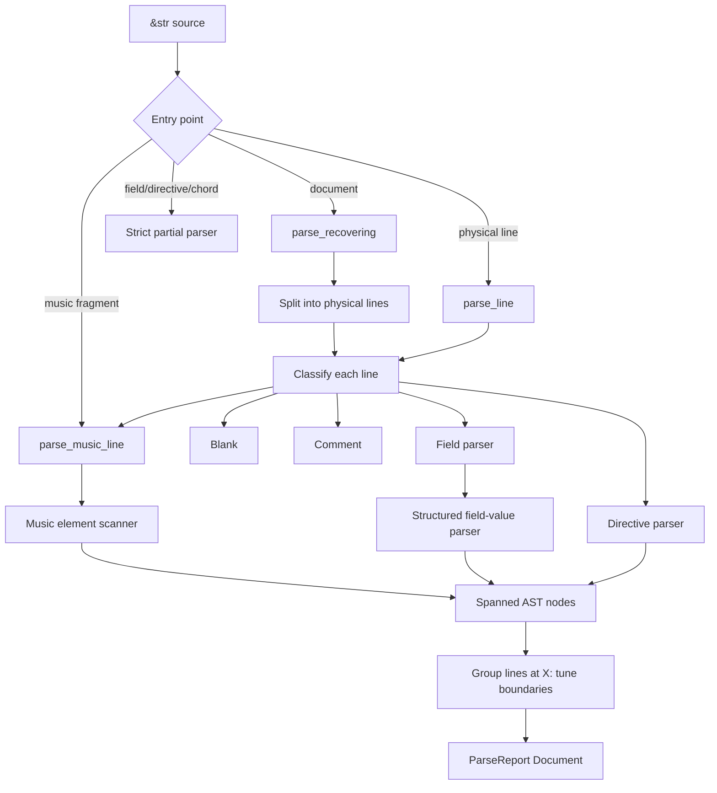
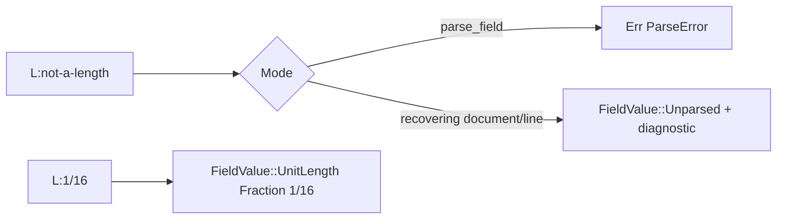
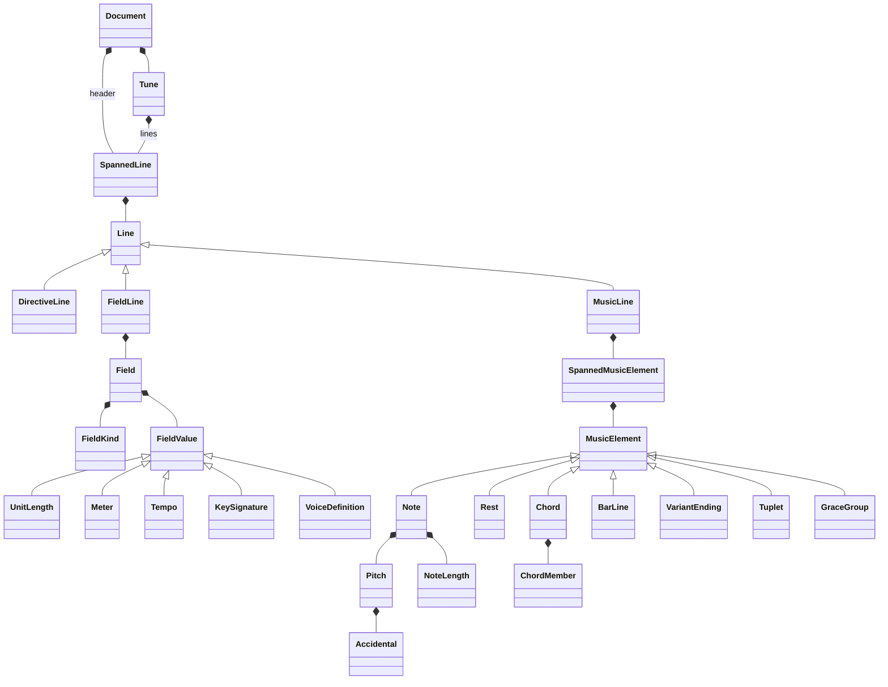

# Parser architecture

This section describes how source text reaches the public AST. All offsets are
UTF-8 byte offsets into the original input. The parser does not require callers
to retain a second token stream: every [`Spanned`] node can be sliced directly
from the original source using its [`Span`].

## Entry points

The complete-document APIs are:

- [`parse_recovering`] always returns a [`ParseReport<Document>`]. Its
  [`ParseReport::output`] contains everything recovered after faults and
  [`ParseReport::errors`] contains source-ordered diagnostics.
- [`parse`] uses the same recovery pass, but returns the AST only when no errors
  were found.
- [`validate`] performs complete parsing and discards a successful AST.

Partial-input APIs are [`parse_line`], [`parse_music_line`], [`parse_field`],
[`parse_directive`], and [`parse_chord`]. They are suitable for editors and for
parsing ABC fragments that are not complete tunes.

The diagram is Mermaid source so it remains portable in generated rustdoc and
renders in documentation front ends that support Mermaid. The surrounding text
contains the same information for plain rustdoc viewers.

## Complete-document flow

[`parse_recovering`] walks the source once at physical-line granularity:

1. `physical_lines` yields each line and its starting byte offset.
2. `parse_line_at` classifies the line by its prefix. `%%` selects a directive,
   `%` selects a comment, and an ASCII letter followed by `:` selects an
   information field. Other non-blank lines are music code.
3. A successful or recovered line is wrapped in [`Spanned<Line>`]. Newline
   bytes are not part of the line span.
4. An `X:` field starts a new [`Tune`]. Lines before the first `X:` remain in
   [`Document::header`].
5. Diagnostics and the [`Document`] are returned together in a [`ParseReport`].

Physical lines are intentional recovery boundaries. ABC fields, directives,
comments, and most music layout constructs cannot consume an arbitrary following
line, so the next line is a dependable place to resume after an unclosed chord,
grace group, decoration, or annotation.

## Information-field flow

[`Field`] records the original letter as [`Field::key`], its standard category
as [`Field::kind`], and a semantic [`FieldValue`]. Structured values use
dedicated parsers:

| Field | AST payload | Examples |
| --- | --- | --- |
| `L:` | [`FieldValue::UnitLength`] | `L:1/8` |
| `M:` | [`FieldValue::Meter`] | `M:3/4`, `M:2+3/8`, `M:C` |
| `Q:` | [`FieldValue::Tempo`] | `Q:1/4=120` |
| `K:` | [`FieldValue::Key`] | `K:G mixolydian clef=bass` |
| `X:` | [`FieldValue::Reference`] | `X:12` |
| `V:` | [`FieldValue::Voice`] | `V:1 name="Soprano"` |
| `P:` | [`FieldValue::Parts`] | `P:A.B.(CD)2` |
| `U:` | [`FieldValue::UserSymbol`] | `U:H=!fermata!` |
| `m:` | [`FieldValue::Macro`] | `m:~n2 = ...` |

Metadata such as titles and composers is represented by
[`FieldValue::Text`]. Application-defined field letters are classified as
[`FieldKind::Extension`] and also retain their text.

Strict [`parse_field`] returns [`ParseError`] when a structured value is
malformed. During document or line recovery, the same payload is retained as
[`FieldValue::Unparsed`] and a diagnostic is added. Inline fields follow the
same rule.

## Music-code flow

`parse_music_at` repeatedly calls the element scanner on the unconsumed suffix.
Each scan returns an element, the number of bytes consumed, and an optional
fault. The driver shifts the local range by the line's starting offset and
emits a [`Spanned<MusicElement>`]. A scanner must consume at least one UTF-8
character, which guarantees progress even for malformed input.

Bracketed input is disambiguated before general tokens:

1. `[A:value]` is an inline field.
2. `[1`, `[1,3`, and `[2-4` are variant endings.
3. `[|...` is a bar line.
4. Other bracketed input is a [`Chord`].

Notes are decomposed into [`Pitch`], optional [`Accidental`], octave, and
[`NoteLength`]. Chords contain typed [`ChordMember`] values rather than source
strings. The Chumsky recognizer enforces the non-empty, delimiter-safe chord
interior before semantic chord-member parsing.

## AST overview

The AST separates document organization, line syntax, structured field values,
and music syntax. [`Spanned<T>`] is used at line and music-element boundaries;
semantic children such as [`Pitch`] do not repeat their parent's span.

The principal [`MusicElement`] families are:

- sound-producing or timing nodes: [`Note`], [`Rest`], [`MultiMeasureRest`],
  and [`Chord`];
- measure structure: [`BarLine`], [`VariantEnding`], and [`Tuplet`];
- phrasing and rhythm: [`Slur`], [`Tie`], [`BrokenRhythm`], and [`GraceGroup`];
- presentation: [`Decoration`], [`Annotation`], beam boundaries, and
  [`LineBreak`];
- multi-voice and context changes: [`Overlay`] and inline [`Field`] nodes.

[`MusicElement::Extension`] is reserved for syntax that cannot be assigned a
standard semantic node. When it represents malformed input it is accompanied by
a diagnostic, preserving bytes without pretending they were understood.

## Errors and recovery invariants

[`ParseError::span`] always refers to the original document, including for
errors found in nested inline fields. Diagnostics are emitted in encounter
order. Recovery maintains these invariants:

- scanning always advances;
- every emitted span is half-open and within the input;
- a malformed structured field retains its trimmed payload;
- an unclosed delimited music construct consumes no later physical line;
- a later tune can still be discovered after faults in an earlier tune.

Callers that require only valid input should use [`parse`] or [`validate`].
Interactive tools usually want [`parse_recovering`] and should render both its
partial AST and its diagnostics.
