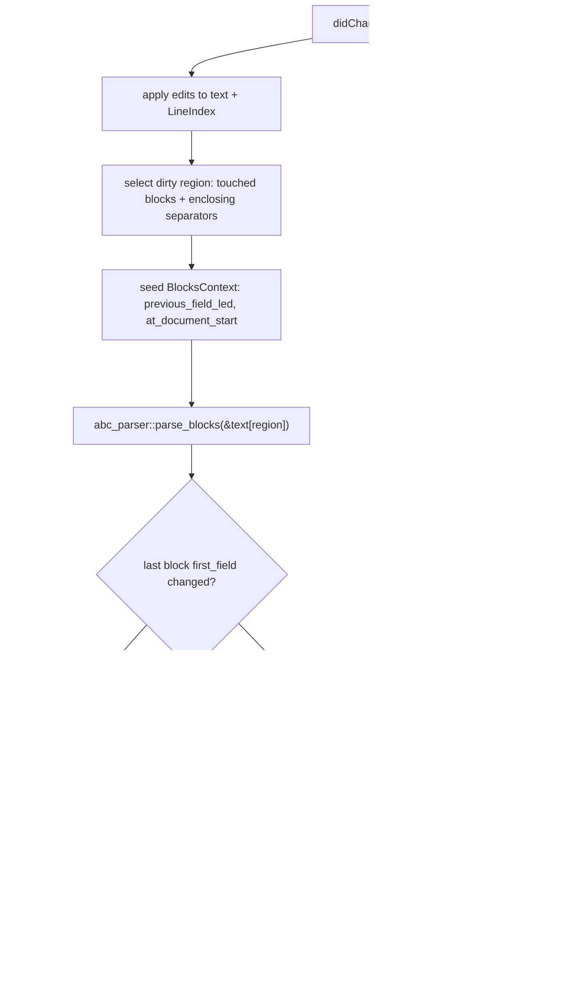

# Plan: incremental updates for abc-language-server

## Summary

Move `abc-language-server` from full-document synchronization and
whole-document reparsing to:

1. **LSP incremental text sync** — advertise
   `TextDocumentSyncKind::INCREMENTAL` and apply ranged
   `TextDocumentContentChangeEvent`s to server-side text.
2. **Incremental analysis** — retain a per-document *block model* and
   re-parse only the blocks affected by an edit, exploiting the fact
   that ABC 2.1 documents are blank-line-delimited blocks with a small,
   fully enumerated set of cross-block dependencies.

The correctness invariant for the whole plan is an **equivalence
property**: after any sequence of incremental updates, the server's
published state (diagnostics, ranges, versions) must be byte-identical
to what a full reparse of the same text would produce. The invariant is
enforced by a property/fuzz harness (task T11) and by defensive
full-reparse fallbacks in the driver.

## Current state (references)

Language server (`abc-language-server/src`):

- `backend.rs:378` advertises `TextDocumentSyncKind::FULL`;
  `did_change` (`backend.rs:435-469`) keeps only the **last** content
  change and treats it as full text.
- Every change rebuilds `DocumentState` (`backend.rs:84-108`):
  `LineIndex::new` + `Analysis::new`, both O(document) per keystroke.
- `Analysis` (`analysis.rs:61-147`) parses the whole document, keeps only
  `diagnostics` and `has_errors`, and **discards the AST**. Bar-duration
  warnings run over the whole owned document (`analysis.rs:72-86`;
  `bar_duration.rs:117-124` reads file-header `M:`/`L:` defaults).
- All feature providers (hover, completions, symbols, folds, selection
  ranges, semantic tokens, formatting, code actions) are stateless
  raw-text scans over `LineIndex`.
- Config changes rebuild every document from source
  (`backend.rs:185-288`).

Parser (`abc-parser/src`):

- The document grammar is already **block oriented**:
  `document_body_parser` (`combinators.rs:2614-2656`) splits input at
  blank-line runs (`block_separator`), parses the first block with
  header-ambiguity resolution (`first_tune_or_header_parser`,
  `combinators.rs:2436-2451`) and later blocks with `block_parser`
  (`combinators.rs:2495-2507`) = `choice(tune_block_parser,
  text_block_parser)`.
- Cross-block parse state is exactly one value:
  `ParserStateValue::last_field_led_span` (`combinators.rs:103-116`),
  the first-field span of the most recent field-led block, consumed by
  `text_block_parser` for the `MissingReference` extra-blank-line hint
  (`combinators.rs:2088-2115`; design in `music-like-diagnostic.md`).
- Document prologue: optional BOM, optional `%abc-<version>` marker that
  forces strict interpretation (`combinators.rs:2599-2612`,
  `2658-2677`).
- `newline()` (`combinators.rs:2527-2536`) accepts LF, CRLF, and CR.

## ABC 2.1 block model and cross-block dependencies

Normative basis: the checked-in `abc-standard-v2.1-source.txt`
(`abc_standard_v2.1.pdf`).

- An abc file is a file header, tunes, free text, and typeset text
  "separated … by empty lines" (§2.2, lines 263-269).
- Empty lines are whitespace-only lines (spaces and tabs), §2.2.4 line
  313. A comment-only line is **not** an empty line, and removing the
  comment removes the whole line without introducing an empty line,
  §2.2.5 line 332.
- The file header may appear **only at the beginning** of the file
  (§2.2.2, lines 283-291). File-header settings are defaults for all
  tunes and are reinstated at the end of each tune.
- A tune is a tune header plus optional tune body, terminated by an
  empty line or end of file (§2.2.1, lines 271-281). A tune without a
  body is legal.
- Typeset text (`%%text`, `%%center`, `%%begintext`…`%%endtext`) may
  appear between tunes or inside a tune; `%%begintext` bodies must not
  contain blank lines inside tunes (§11.4.5, line 2291).
- Free text can be "any text not containing information fields"
  anywhere after the file header (§2.2.3, lines 293-307).

Complete list of dependencies that cross a block boundary (each is
handled by an explicit rule in "Invalidation rules"):

| #  | Dependency                                                                 | Spec                                      | Effect on neighbors                                                                       |
| --- | --------------------------------------------------------------------------- | ------------------------------------------ | ------------------------------------------------------------------------------------------- |
| D1  | Block boundaries themselves (blank-line runs)                                | §2.2.4                                    | Adding/removing a blank line merges/splits blocks on both sides.                            |
| D2  | First block may resolve as the file header                                    | §2.2.2                                    | Only affects block 0's own resolution.                                                      |
| D3  | File-header `M:`/`L:` defaults                                                 | §2.2.2, §3.1.6-3.1.7                      | Affects bar-duration analysis of **all** tunes.                                             |
| D4  | `MissingReference` hint depends on the previous block's first field            | `music-like-diagnostic.md`                 | Editing a field-led block can change the *next* text block's warning (and its related span). |
| D5  | Version marker `%abc-2.1`                                                     | §2.1, lines 248-261                        | Selects strict interpretation for the whole document; only line 1 can carry it.             |
| D6  | Tune-scoped analyses: bar duration now; lyric alignment (`w:` binds to notes anywhere earlier in the tune body, §5.1 lines 1345-1378, §10.6) later | §5.1                        | The **tune**, not the line, is the invalidation unit for semantic analyses. A tune is exactly one block. |

Everything else is block-local. Note the motivating example: free text
may "become music" — a fieldless text block emits the `MissingReference`
music-like warning, and the *variant* of that warning (with the
extra-blank-line hint) depends on whether the block before it just
became a valid (field-led) header. That is D4, and it is why the dirty
region can grow by one subsequent block.

Within a block, these constructs bind adjacent lines (all handled
automatically because the whole block is reparsed):

- `+:` field continuation (§3.3, lines 805-830);
- deprecated implicit `H:` continuation (§3.1.13, lines 642-655);
- backslash continuation of music code (§6.1.1, lines 1494-1541; a
  backslash must not be used before an empty line, line 1515);
- `%%begintext`…`%%endtext` groups (§11.4.5).

## Specification findings (pre-requisite and parallel tasks)

Findings are violations of, or departures from, ABC 2.1 discovered while
reading the code against the standard. Each is dispositioned as a hard
prerequisite (needed for correctness of incremental updates) or as an
independent conformance task.

### SV-1 (hard prerequisite): CR-only line endings mishandled by the LS position layer

ABC 2.1 §8.1 (line 1719) requires applications to interpret LF, CRLF, and
CR line endings correctly; the parser's `newline()` does
(`combinators.rs:2527-2536`). But `LineIndex::new`
(`position.rs:20-32`) builds `line_starts` from `\n` only, and the
ad-hoc scanners split on `\n` (`analysis.rs:331,408,546,631`,
`backend.rs:732`). A CR-only document therefore becomes one giant
"line": diagnostics and LSP positions are misaligned and — critically
for this plan — **ranged incremental edits would splice at wrong byte
offsets**.

The parser's `DiagnosticRenderer` has the same line-numbering defect
for CR-only files (`lib.rs:1223-1234` builds `line_starts` from `\n`,
even though `line_end` at `lib.rs:1237-1239` finds `\r`).

Fix tasks: T1 (LS), T4 (parser renderer).

### SV-2 (parallel): unknown information fields produce no advisory

§3 (line 441): programs "must ignore the occurrence of information
fields not defined here (although they should give a non-fatal error
message to warn the user)". The parser silently maps unknown letters to
`FieldKind::Extension` (`combinators.rs:1011-1031` warns only for
deprecated `A:`/`E:`). Fix task: T5.

### SV-3 (parallel): no strict-mode diagnostics for misplaced fields

§3 (line 443): identifiers `A-G`, `X-Z`, `a-g`, `x-z` "are not permitted
in the body" (e.g. a `B:` line after music code has begun parses as a
field without comment, `combinators.rs:1693-1714`). §6.1.1 (line 1492):
`I:linebreak` "instructions are not allowed in the tune body". §6.1.1
(line 1515): a backslash before an empty line "must not be used". None
are diagnosed, even under strict interpretation. Fix task: T6
(strict-mode advisories only; loose interpretation stays permissive per
§12.2).

### SV-4 (follow-up): LS raw-text heuristics produce false diagnostics on spec-legal text

- `legacy_decorations` (`analysis.rs:202-210`) scans the entire raw
  text; free text like `3+4+5` yields a spurious "legacy +name+
  decoration" warning, because the scan cannot see that the bytes are
  not music code.
- `hover` (`analysis.rs:212-225`) treats any line whose second byte is
  `:` as an information field (free text `a: hello` shows field help).
- `document_symbols`/`folding_ranges` (`analysis.rs:328-435`) classify
  lines with `starts_with("X:")` / `strip_prefix("V:")`, and the
  X:-to-X: symbol range swallows intervening free text.

These are consequences of discarding the AST (see "Current state").
Fix task: T7/T13 (drive the scans from the retained block model).

### SV-5 (prerequisite-adjacent): leading-whitespace field lines are classified inconsistently

Empirically verified against the current parser:

- `parse_line("  X:1")` classifies the line as **Music** (leading
  whitespace makes `recovering_field_parser` fail at the line start;
  `X` parses as a multi-measure rest, `:` as a liberal bar), while
  inside a tune block the same text parses as a **Field** (tune lines
  go through `spanned_nonblank_line`, which consumes leading
  whitespace, `combinators.rs:1776-1802`).
- Consequently an indented `X:` cannot start a tune: the block is
  fieldless and becomes free text with a `MissingReference` warning.
- Inside a text block an indented field line is **silently** accepted
  as free text, while a flush field line produces the "information
  fields are not allowed in free text" error
  (`tests/document_text.rs:350-362` covers only the flush case).

Per §3 (line 437) an information field is a line *beginning* with a
letter, so treating indented fields as non-fields is spec-conformant;
the violation is the **inconsistency** (tune-mode accepts them as
fields; text-mode silently drops them), and the LS scanners disagree
with both. The incremental block index must reproduce parser
classification exactly, so this must be settled first. Fix task: T2b.

### Non-violations, recorded for completeness

- Dialect switching (`I:linebreak`, `I:decoration`, per-tune
  `I:abc-version`) is not interpreted; the parser always applies the
  2.1 defaults. This is permitted loose interpretation (§12.2, lines
  2424-2436) and is a **non-goal** here.
- `%abc-2.0`-style markers correctly fall back to loose interpretation
  (marker filter, `combinators.rs:2599-2612`).

## Design

### Ownership split

- **abc-parser** owns grammar and segmentation: it gains a small public
  block-scoped parse API plus a version-marker predicate helper. The
  document grammar is refactored so `parse`/`parse_with_options` and
  the new API share one code path (no grammar fork).
- **abc-language-server** owns invalidation policy: text splicing,
  position conversion, block bookkeeping, dirty-region computation,
  context seeding, diagnostics assembly, publishing, and fallbacks.

Rejected alternative: a full incremental engine inside abc-parser
(retained text + edit API). It would grow the parser's public API with
LSP-adjacent policy (config-driven severities, document versions) that
does not belong there; the block API keeps the parser batch-oriented and
reusable (e.g. by `abc-lint`), and the LS keeps full control of
fallbacks.

### Parser API additions (abc-parser)

```rust
/// One blank-line-delimited block parsed in isolation.
pub struct ParsedBlock<S = Span> {
    /// Physical-line span of the block content, slice-relative,
    /// excluding the surrounding blank-line separators.
    pub span: S,
    /// Document items produced by the block (leading comments of a
    /// tune become `DocumentItem::Comment` entries, as today).
    pub items: Vec<Spanned<DocumentItem<S, SourceText<S>>, S>>,
    /// File-header lines when this block resolved as the file header.
    pub header: Vec<Spanned<Line<S, SourceText<S>>, S>>,
    /// Span of the first information field when the block is field-led.
    /// `Some` exactly for tune and file-header blocks.
    pub first_field: Option<S>,
}

/// Context needed to parse blocks in isolation with full-parse fidelity.
pub struct BlocksContext<S = Span> {
    /// The slice begins the document; enables the BOM/version-marker
    /// prologue and file-header resolution of the first block.
    pub at_document_start: bool,
    /// First-field span of the immediately preceding field-led block,
    /// seeding the `MissingReference` extra-blank-line hint.
    pub previous_field_led: Option<S>,
}

/// Parses one or more blank-line-separated blocks from `input`.
///
/// Diagnostics and spans are relative to `input` (the caller re-bases).
pub fn parse_blocks<'src>(
    input: &'src str,
    options: ParserOptions,
    context: BlocksContext<Span>,
) -> ParseReport<Vec<ParsedBlock>>;
```

Implementation notes:

- Refactor `document_body_parser` (`combinators.rs:2614-2656`) into a
  blocks combinator that yields `Vec<ParsedBlock>`, plus a small
  assembler used by `parse_with_options` to build `Document`
  (`assemble_document`, `combinators.rs:2570-2597`, moves to consuming
  `ParsedBlock`s). `parse`/`parse_with_options` observable behavior must
  not change (golden tests against the existing conformance suites).
- `at_document_start = true` reproduces the `document_parser` prologue
  (`combinators.rs:2658-2677`): optional BOM, optional strict marker
  (which forces strict interpretation for the slice), leading blank
  lines, and first-block header resolution
  (`first_tune_or_header_parser`). `at_document_start = false` uses the
  non-first grammar (`block_parser`) for every block in the slice and
  **must not** resolve a file header.
- Seed `ParserStateValue::last_field_led_span` from
  `context.previous_field_led`. The state is only read by
  `text_block_parser` and only written by tune/header resolution, so a
  seeded region parse reproduces full-parse hint behavior.
- The slice may end with blank-line separators or at EOF
  (`block_separator.or_not()` handling already exists).
- Expose the marker predicate as
  `pub fn version_marker(line: &str) -> Option<bool>` (`Some(true)` =
  strict marker consumed by the prologue), extracted from
  `strict_version_marker` so the LS never re-implements it.

Spans stay **slice-relative**; the LS re-bases. Rationale: chumsky
spans are native to the input slice; re-basing
`ParseError`/`ParseWarning` spans (including `RelatedSpan`s) is a
mechanical `+ base` map, and the retained per-block AST is consumed
through a base-aware resolver anyway.

### LS document model (abc-language-server)

New module (e.g. `document.rs`), replacing the analysis half of
`DocumentState`:

```rust
struct DocumentModel {
    version: i32,
    encoding: PositionEncodingKind,
    config: Config,
    strict: bool,                    // config.strict || version marker
    text: String,
    index: LineIndex,
    header: HeaderSnapshot,          // from block 0: M:/L: defaults
    blocks: Vec<BlockRecord>,
}

struct BlockRecord {
    lines: Range<usize>,             // content span, document-absolute
    base: usize,                     // offset the AST/diagnostics are relative to
    parsed: ParsedBlock,             // slice-relative spans (from abc-parser)
    tune_analysis: Option<TuneAnalysis>, // bar-duration warnings, slice-relative
}
```

- `DocumentModel::full(text, …)` builds everything with one
  `parse_blocks(text, …, at_document_start = true)` call (used by
  `did_open`, config replacement, and as the fallback path).
- `DocumentModel::apply_changes(changes, version)` is the incremental
  entry point (next section).
- Diagnostics are stored **typed** (parser kinds + spans, plus semantic
  warnings) and converted to LSP `Diagnostic`s at publish time. A
  config change to severities then only re-converts and re-publishes
  (plus re-runs tune analyses if their level changed) without
  reparsing.
- `has_errors` is the OR of per-block parser-error flags.

### Invalidation rules (the heart of the design)

Definitions (matching the parser exactly):

- An **empty line** contains only spaces/tabs (§2.2.4); comment-only
  lines are not empty (§2.2.5).
- A **block** is a maximal run of non-empty lines; blocks are separated
  by runs of empty lines. `%%begintext` bodies never contain empty
  lines (§11.4.5), so this segmentation is safe for them.

On `did_change` with one or more ranged edits (after applying them to
`text`):

1. **Region selection.** A *touched block* is any block whose line span
   intersects any edit range; an edit landing inside a separator run
   touches the blocks on **both** sides (the separator may have been
   created or destroyed — D1). The **dirty region** spans from the
   start of the first touched block (or byte 0 when the edit touches
   leading separators or line 1) through the end of the blank-line run
   following the last touched block — i.e., up to the first line of the
   next untouched block, or EOF. Region boundaries therefore always sit
   at parser-recognized block boundaries, and block merges/splits
   inside the region are re-derived by the parser itself.
2. **Context seeding.** Seed `BlocksContext.previous_field_led` from
   the retained block preceding the region (its `first_field`, or
   `None`) — D4 look-back. `at_document_start` is true iff the region
   starts at byte 0.
3. **Region parse.** Call `parse_blocks` on `&text[region]`; re-base
   the returned diagnostics (spans and related spans) by
   `region.start`. Debug-assert that the parse consumed the entire
   slice; on mismatch, fall back to `DocumentModel::full` (defensive;
   the equivalence harness must never observe this in tests).
4. **Forward cascade (D4).** Compare the region's **new** last block
   `first_field` (re-based) with the old last block's stored value. If
   they differ — including the `Some`/`None` flip *and* the span value,
   since the following text block's hint carries the related span —
   extend the region through the **next** block and re-parse. The
   re-parsed neighbor's content is unchanged, so its `first_field`
   cannot change again; the cascade terminates after at most one extra
   block. This implements the "free text becomes music when the current
   block becomes a valid header" case.
5. **Splice.** Replace the region's block records with the new ones
   (all with `base = region.start`), shift the `lines` spans and
   `base` fields of all following blocks by the text-length delta, and
   update `text`/`index`.
6. **Tune-scoped analyses (D6).** For every **re-parsed** tune block,
   re-run `bar_duration_warnings` over a synthetic single-tune
   `Document` built from the retained file header plus that tune. If
   the file-header block was re-parsed **and** its `M:`/`L:` defaults
   changed (D3), mark every tune's analysis dirty and re-run all of
   them. Retained, unedited tune analyses are reused as-is.
7. **Text-level scans.** The legacy-decoration scan (and any other
   raw-text scan) runs per re-parsed block over `&text[block.lines]`
   only, not per keystroke over the whole document.
8. **Publish.** Assemble diagnostics in exactly the order
   `Analysis::new` produces today — parser errors sorted by span, then
   parser warnings sorted by span, then bar-duration warnings in tune
   order, then legacy-decoration warnings in block order — and publish
   with the document version. (Block order equals span order, so the
   concatenation of per-block sorted buckets reproduces the global
   sort.)

**Full-reparse fallbacks** (always correct, never stale):

- version-marker line (line 1) edited, inserted, or deleted — D5;
- any invariant/consistency check inside the driver fails;
- a change with `range: None` (full replacement);
- `did_open`, config replacement, and initial build.

An owned-AST resolver for step 6:

```rust
struct OffsetResolver<'a> { base: usize, source: &'a str }
// impl SourceResolver<SimpleSpan<usize>> delegating to the `str`
// impl with `base` added to spans; used with IntoOwnedAst::into_owned
// to build the synthetic single-tune Document for bar-duration checks.
```

### Edit application (Layer 0)

- Advertise `TextDocumentSyncOptions { open_close: true, change:
  TextDocumentSyncKind::INCREMENTAL }` (lsp-types 0.95 via
  tower-lsp-server 0.23 supports this).
- Apply **every** `TextDocumentContentChangeEvent` in order (the
  current `.last()` behavior at `backend.rs:436` is a latent bug once
  sync is incremental): `range: None` replaces the whole text;
  otherwise convert `range.start`/`range.end` via `LineIndex::byte_offset`
  with the negotiated encoding and splice with `String::replace_range`.
  Ignore the deprecated `rangeLength`.
- Rebuild `line_starts` for the affected window. v1 may rebuild the
  whole `LineIndex` (a single byte scan; parsing dominates cost). A
  rope (e.g. `ropey`) is a possible later optimization; not required.
- Keep the existing version guard (ignore regressed versions) and the
  `spawn_blocking` + re-check pattern (`backend.rs:97-108`).

### Feature providers

Unchanged for correctness: hover, completions, selection ranges,
semantic tokens, formatting, and code actions are request-time scans
over the updated `text`/`LineIndex`, and incremental sync keeps both
current. Follow-up track T13 optionally re-points symbols, folds, and
the SV-4 fixes at the block model.

### Update pipeline



## Tasks

Each task lists prerequisites and acceptance criteria. Unless noted,
tasks in different tracks touch disjoint files and can proceed in
parallel. Verification for every task: `cargo nextest run`, `cargo test`
(doc tests), `CARGO_BUILD_WARNINGS=deny cargo clippy`, nightly
`rustfmt`; commit messages per `AGENTS.md` (72-char wrap, AI trailer
block; note deliberate public-API breaks).

### Track 0 — correctness prerequisites

- [x] **T1. LS: correct line-ending handling (SV-1, LS half)** ✅ commit `61b05e3`
  - Files: `abc-language-server/src/position.rs`; the `\n`-splitting
    scanners in `analysis.rs` (`document_symbols`, `folding_ranges`,
    `lexical_tokens`, `note_duration_ranges`) and
    `whitespace_edits` in `backend.rs` (move them onto line iteration
    provided by `LineIndex`).
  - Prerequisites: none. Parallel with all parser tasks (disjoint
    files); **must land before T9 and T10** (edit application depends
    on correct position mapping).
  - Change: `LineIndex` treats `\r\n`, `\n`, and a `\r` not followed by
    `\n` as line breaks, mirroring `combinators::newline`.
    `line_content_end` and `byte_offset` handle all three; scanners no
    longer assume `\n`.
  - Acceptance: unit tests — position/offset round-trips on LF, CRLF,
    and CR-only documents (including a CR-only file whose diagnostics
    match its LF twin exactly, byte-for-byte after newline
    normalization); existing tests green.

- [x] **T2. Parser: block-scoped parse API (design above)** ✅ commit `753f3ee`
  - Files: `abc-parser/src/combinators.rs`, `abc-parser/src/lib.rs`,
    `abc-parser/docs/architecture.md`, new integration test module
    (e.g. `abc-parser/tests/blocks.rs`).
  - Prerequisites: none (independent of T1).
  - Change: refactor `document_body_parser` so `parse_with_options` and
    the new `parse_blocks` share one grammar; add `ParsedBlock`,
    `BlocksContext`, `parse_blocks`, `version_marker`.
  - Acceptance:
    - `parse`/`parse_with_options` outputs and diagnostics are
      byte-identical before/after (golden test over the §13 sample
      tunes, the existing conformance suites, and the edge corpus
      below).
    - Property test: for any document and any block-aligned region R,
      `parse_blocks(&D[R], context seeded from the preceding block)`
      returns items/diagnostics equal to the corresponding slice of
      `parse(D)` (re-based), including `MissingReference` related
      spans and the header resolution of block 0.
    - `version_marker` vectors match `strict_version_marker` behavior
      (`%abc-2.1`, `%abc-2`, `%abc-2.0`, `%abc-3`, `%abc-2.1x`,
      `%abc`, `%abc-`, empty line).

- [x] **T2b. Parser: settle and document indented-field semantics (SV-5)** ✅ commit `ff0d77f`
  - Files: `abc-parser/src/combinators.rs` (only if the decision changes
    behavior), `abc-parser/docs/architecture.md` (always),
    `abc-parser/tests/document_text.rs`.
  - Prerequisites: none; coordinate with T2 (same files) — land either
    before the other, not concurrently.
  - Change: decide one rule for leading horizontal whitespace before
    field letters and apply it consistently across `parse_line`,
    tune-line classification, and free-text classification; document
    the decision with spec citations (§3 line 437). Minimal option:
    keep current classification but make the text-block path diagnose
    indented field lines exactly like flush ones and add tests for all
    three contexts.
  - Acceptance: the three contexts (standalone line, line inside a
    tune, line inside free text) behave per one documented rule;
    block-index reproduction (T10) has a normative reference.

- [x] **T4. Parser: DiagnosticRenderer CR line numbering (SV-1, parser half)** ✅ commit `150834c`
  - Files: `abc-parser/src/lib.rs` (`diagnostic_lines`,
    `lib.rs:1207-1257`).
  - Prerequisites: none; parallel with everything (isolated function).
  - Acceptance: rendered line:col for CR-only documents matches the LF
    twin; existing renderer tests green.

### Track A — conformance gaps surfaced during review (independent)

- [x] **T5. Parser: advisory for unknown information fields (SV-2)** ✅ commit `c8b6921`
  - Files: `abc-parser/src/combinators.rs` (field parsers), `lib.rs`
    (`ErrorKind`), tests.
  - Prerequisites: none. Parallel with Track 0 (distinct code path);
    rebase if it conflicts with T2's combinator refactor.
  - Change: emit a non-fatal `ParseWarning` (new `ErrorKind` variant,
    e.g. `UnrecognizedField`) for field letters outside the §3 table,
    physically and inline; keep the "must ignore" behavior (payload
    retained as today).
  - Acceptance: warning fires for e.g. `Y:unknown` and `[Y:x]`, not for
    defined or deprecated-but-listed letters; default LS mapping treats
    it as a warning; conformance suites updated deliberately.

- [x] **T6. Parser: strict-mode advisories for misplaced constructs (SV-3)** ✅ commit `36306a4`
  - Files: `abc-parser/src/combinators.rs` (tune resolution), `lib.rs`
    (`ErrorKind`), tests; `abc-language-server/src/analysis.rs` only if
    a severity mapping is added.
  - Prerequisites: none; same rebase note as T5.
  - Change: under `ParserOptions::strict` only, warn for (a)
    header-only fields appearing in the tune body (§3 line 443), (b)
    `I:linebreak` in the tune body (§6.1.1 line 1492), (c) a backslash
    at the end of a music line immediately before an empty line
    (§6.1.1 line 1515).
  - Acceptance: advisories appear in strict mode only; §13 sample
    tunes and the conformance suites stay clean; each case has a
    focused test.

### Track B — incremental core

- [x] **T8. LS: block model with full-rebuild path only** ✅ commit `de70004` (Track A marker)
  - Files: new `abc-language-server/src/document.rs`;
    `backend.rs` (`DocumentState` rewires to the model);
    `analysis.rs` (diagnostic assembly moved to the model); tests.
  - Prerequisites: T1 (correct line iteration), T2 (for classification;
    can be developed concurrently behind a `parse`-based shim, but the
    PR depends on T2).
  - Change: implement `DocumentModel`, `BlockRecord`,
    `DocumentModel::full` (one `parse_blocks` call over the whole
    text), typed diagnostic storage, publish assembly (order identical
    to today's `Analysis::new`), `has_errors`, per-tune bar-duration
    analysis with the `OffsetResolver`. No incremental updates yet:
    every `did_change` still rebuilds via `full`.
  - Acceptance: golden test — published diagnostics (message, severity,
    code, range, tags, order) and `has_errors` identical to the current
    implementation across the equivalence corpus (see T11); existing
    protocol test green.

- [x] **T9. LS: incremental text synchronization** ✅ commit `c97088e`
  - Files: `backend.rs` (capabilities, `did_change`),
    `position.rs` (edit application helper), `README.md` (the "full
    document synchronization" sentence), tests.
  - Prerequisites: T1. Parallel with T8 (different concern; small
    merge overlap in `backend.rs` — land sequentially to avoid
    conflicts).
  - Change: advertise `TextDocumentSyncKind::INCREMENTAL` via
    `TextDocumentSyncOptions { open_close: true, change: INCREMENTAL }`;
    apply all changes in order; `range: None` = full replacement (full
    rebuild). Analysis remains the T8 full path per change in this
    task (a safe, shippable intermediate: bandwidth win, zero
    correctness risk).
  - Acceptance: unit tests applying multi-change notifications
    (insert/delete/replace, multi-line, astral UTF-16 positions, CRLF,
    CR-only, edit at EOF, edit of empty document) produce exactly the
    expected text; protocol-level test through the `LspService` harness
    sends a ranged `didChange` and asserts the versioned diagnostics
    equal the full-sync baseline; regressed versions ignored as today.

- [x] **T10. LS: incremental analysis driver** ✅ commit `866f3c4`
  - Files: `document.rs` (region selection, seeding, cascade, splice,
    per-tune analyses, fallbacks), `analysis.rs` (block-scoped
    legacy-decoration scan), tests.
  - Prerequisites: T2, T8, T9.
  - Change: implement the invalidation rules exactly as specified
    above, including the forward cascade, header `M:`/`L:` invalidation
    (D3), line-1/version-marker fallback (D5), and the defensive
    full-rebuild fallback.
  - Acceptance:
    - the T11 equivalence property holds over randomized edit scripts;
    - structural performance assertion: for single-block edits on a
      generated multi-tune tunebook (≥ 500 tunes), the driver re-parses
      at most (touched blocks + 1) blocks and re-runs bar duration for
      at most the touched tunes (all tunes only when header `M:`/`L:`
      changed) — verified via a test-visible counter, not timing;
    - all fallback paths have dedicated tests (line-1 edit, `None`
      range, forced invariant failure).

- [x] **T11. LS+parser: equivalence and fuzz harness** ✅ commit `0017b71`
  - Files: new integration test crate/module (e.g.
    `abc-language-server/tests/incremental_equivalence.rs`) plus a
    small shared corpus; optional dev-only env flag
    (e.g. `ABC_LS_FORCE_FULL_REPARSE`) for rollout triage.
  - Prerequisites: developed alongside T8 (corpus + golden) and
    completed with T10 (property harness).
  - Corpus must include: the four §13 sample tunes; tunes with `w:`/`W:`
    lyrics and `+:` continuations; deprecated implicit `H:` groups;
    `%%begintext`/`%%endtext` blocks between tunes and inside tunes;
    music-like free text after tunes (both `MissingReference` variants
    and related spans); unknown fields; indented fields (per T2b's
    documented rule); strict (`%abc-2.1`) and loose files; LF, CRLF,
    CR-only; no final newline; whitespace-only separator lines;
    comment-only lines adjacent to blank lines; empty document;
    header-only document.
  - Acceptance: deterministic seeded edit scripts (insert, delete,
    replace; single-line and multi-line; blank-line insertion/removal;
    EOF appends) — after each edit, the incremental model's published
    diagnostics and block structure are byte-identical to a full
    rebuild from the same text. Fuzz runs in CI (nextest) with several
    seeds; a long-run mode is documented but not required in CI.

- [x] **T12. LS: config and open paths over the model** ✅ commit `6731013`
  - Files: `backend.rs` (`did_open`, `replace_config`,
    `refresh_configuration`), `document.rs`.
  - Prerequisites: T10.
  - Change: `did_open` and config replacement use `DocumentModel::full`
    (already from T8); severity-level changes re-convert typed
    diagnostics (and re-run tune analyses when their level changed)
    without reparsing; strict-mode config flips use the full path.
  - Acceptance: changing any `DiagnosticLevel` publishes identical
    results to a cold open with the same config; no reparse occurs on
    severity-only changes (assert via a parse counter in tests).

### Track C — follow-ups (optional, independent)

- [ ] **T13. LS: drive symbols, folds, and SV-4 fixes from the block model**
  - Files: `analysis.rs`, `document.rs`.
  - Prerequisites: T10 (T8 sufficient for read-only features).
  - Change: `document_symbols` and `folding_ranges` iterate block
    records (tune spans no longer overrun into following free text;
    indented `V:` handled per the T2b rule); the legacy-decoration scan
    and `hover` field detection consult per-block AST line
    classifications instead of raw byte patterns (fixes the `3+4+5`
    and `a: hello` false positives).
  - Acceptance: targeted regression tests for each false positive;
    symbol/fold snapshots unchanged for the §13 corpus.

- [ ] **T14. Docs**
  - Files: `README.md` (sync kind — partly in T9), parser
    `docs/architecture.md` (block API), a short design note in
    `abc-language-server` README describing the invalidation model.
  - Prerequisites: respective feature tasks.
  - Acceptance: documentation matches shipped behavior; no stale
    "full document synchronization" claims.

## Task checklist

Legend: `[ ]` pending. Order within a track is the recommended sequence;
tracks are parallel unless a prerequisite says otherwise.

Track 0 (correctness prerequisites):

- [x] T1 — LS line-ending correctness (SV-1) … blocks T9, T10 ✅ `61b05e3`
- [x] T2 — parser `parse_blocks` API … blocks T8, T10 ✅ `753f3ee`
- [x] T2b — indented-field rule settled (SV-5) … blocks T10 fidelity ✅ `ff0d77f`
- [x] T4 — parser DiagnosticRenderer CR fix (SV-1) … parallel ✅ `150834c`

Track A (conformance, parallel; independent of Track B):

- [x] T5 — unknown-field advisory (SV-2) ✅ `c8b6921`
- [x] T6 — strict-mode misplaced-construct advisories (SV-3) ✅ `36306a4`

Track B (incremental core):

- [ ] T8 — block model + full-rebuild path (needs T1, T2)
- [ ] T9 — incremental text sync (needs T1; parallel with T8, land
      sequentially in `backend.rs`)
- [ ] T10 — incremental analysis driver (needs T2, T8, T9)
- [ ] T11 — equivalence/fuzz harness (started with T8, done with T10)
- [ ] T12 — config/open paths over the model (needs T10)

Track C (follow-ups):

- [ ] T13 — symbols/folds/SV-4 from block model (needs T8; best after
      T10)
- [ ] T14 — documentation sweep (with respective tasks)

Parallelism summary:

- T1, T2, T4, T5, T6 are mutually parallel (disjoint files; T2/T2b and
  T5/T6 share `combinators.rs` — land sequentially or rebase).
- T8 and T9 are logically parallel but both touch `backend.rs`; land
  sequentially.
- Track A never blocks Track B; if it lands after T10, the equivalence
  corpus must be extended with its new diagnostics (single-line item).

## Risks and edge cases

- **Grammar drift between the block index and the parser.** Mitigated:
  the parser owns segmentation and classification (`parse_blocks`);
  the LS only finds region boundaries via retained block spans and a
  local blank-line scan; the T11 property test compares against
  `parse`/`parse_with_options` ground truth; defensive fallback.
- **Region-boundary bugs** (starting a region mid-block) produce stale
  or misplaced diagnostics. Mitigated: region boundaries are defined at
  blank-line runs; the "parse consumed the whole slice" invariant;
  full-rebuild fallback; fuzz harness.
- **D4 cascade subtleties**: the related span of the following block's
  hint points at the *first field* of the preceding block, so the
  cascade compares span values, not just `Some`/`None`.
- **UTF-16 offsets inside multi-byte characters**: edits always pass
  through `LineIndex::byte_offset` (existing boundary checks,
  `position.rs:91-117`); astral-plane characters covered in T9 tests.
- **Clients that ignore the negotiated sync kind**: a ranged change
  under FULL expectations (or vice versa) is covered because
  `range: None` and unknown-version documents degrade to the full
  path.
- **Large paste / whole-file replacement**: `range: None` or a range
  covering all blocks takes the full path — bounded work, no pathological cascades.
- **Public-API growth in abc-parser** (`ParsedBlock`, `BlocksContext`,
  `parse_blocks`, `version_marker`, possible new `ErrorKind`
  variants): acceptable while the crate is unpublished (`AGENTS.md`);
  note deliberate breaks in commit messages.
- **Bar-duration analysis fidelity**: the synthetic single-tune
  `Document` must carry the file header lines exactly as
  `bar_duration_warnings` expects (`bar_duration.rs:117-124`); the T8
  golden test over the full corpus guards this.

## Non-goals

- No dialect switching (`I:linebreak`, `I:decoration`, per-tune
  `I:abc-version`); loose interpretation remains the default and
  strict remains structural (§12.2/§12.3).
- No incremental semantic-token deltas, no cancellation/debounce
  infrastructure, no workspace-wide caching.
- No rope-based text storage in v1; the `LineIndex` rebuild is a
  measured, acceptable O(n) with tiny constants.
- No new lyrics-alignment analysis; when added, it slots into the
  per-tune analysis bucket (D6) without new invalidation rules.
- No change to `abc-lint` or `abc-transpose` behavior beyond what the
  shared-grammar refactor (T2/T4) preserves.
